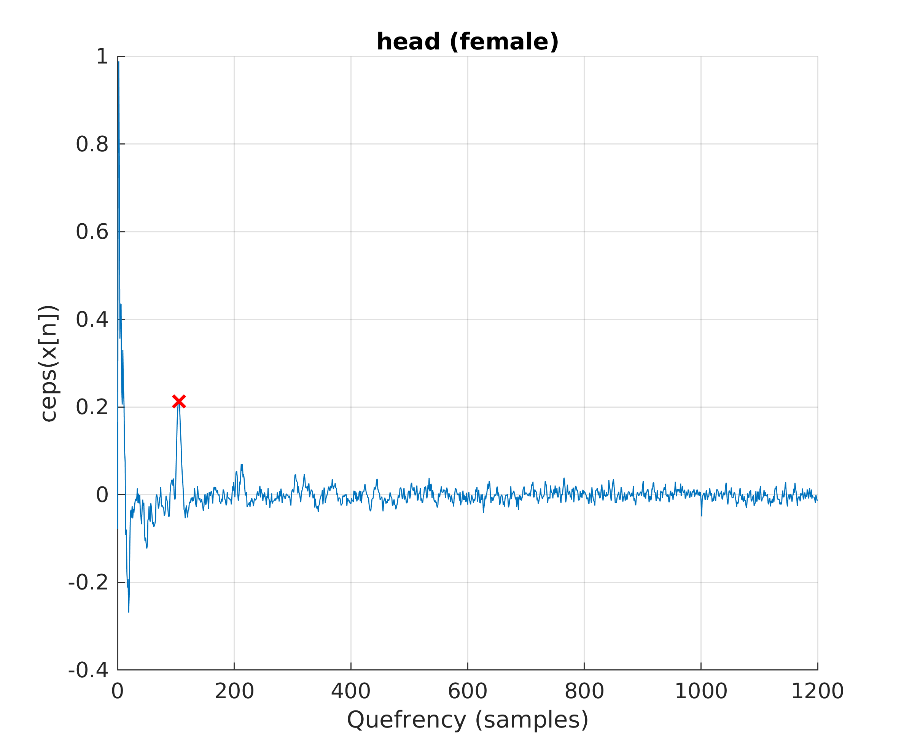
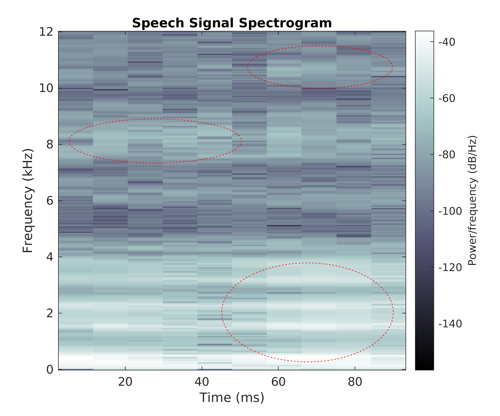
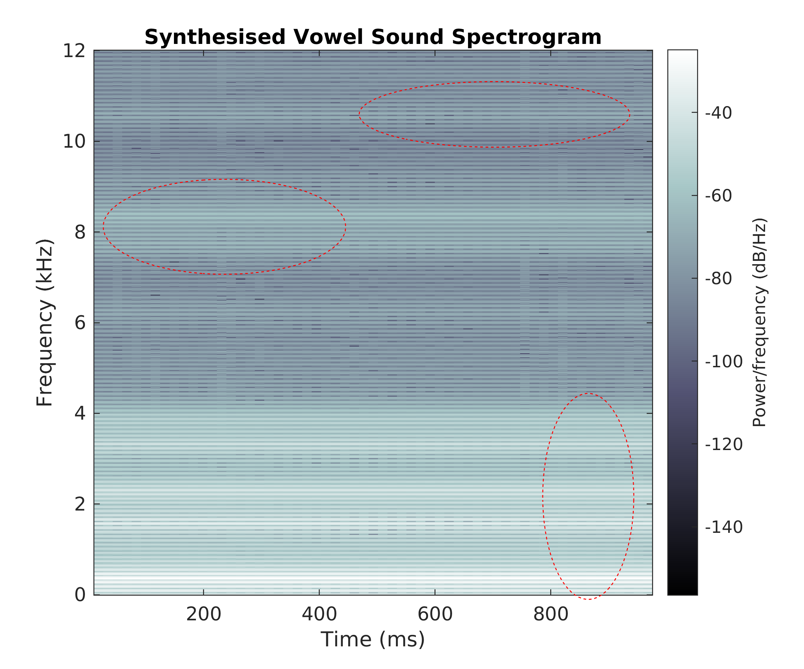
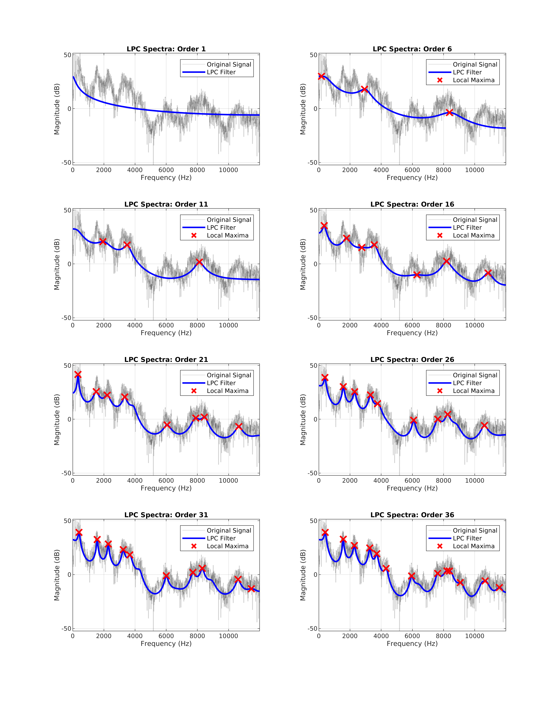

Linear Predictive Speech Synthesizer
==========================

Coursework for Speech & Audio Processing & Recognition module, a source-filter speech system utilising LPC filters.

Various orders of filter are investigated while subjective assessments are made as to the quality of synthesised speech samples.

